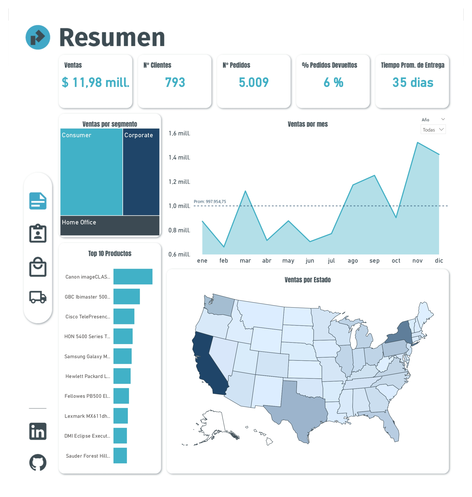
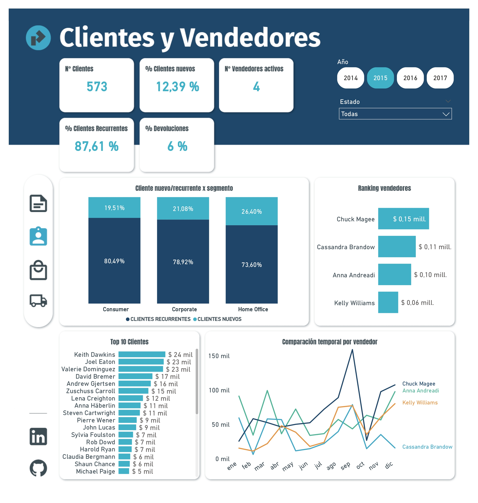
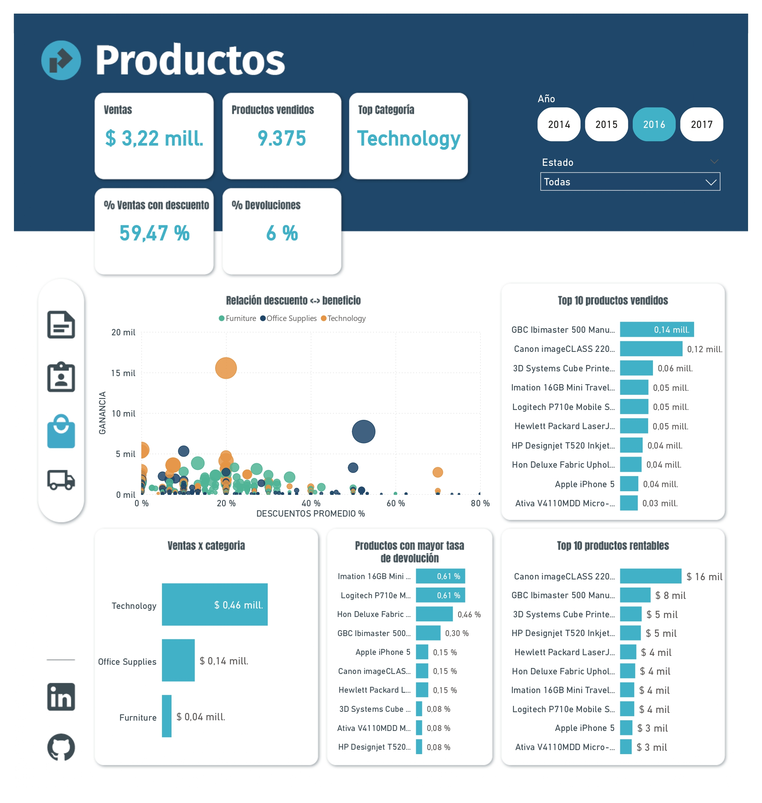
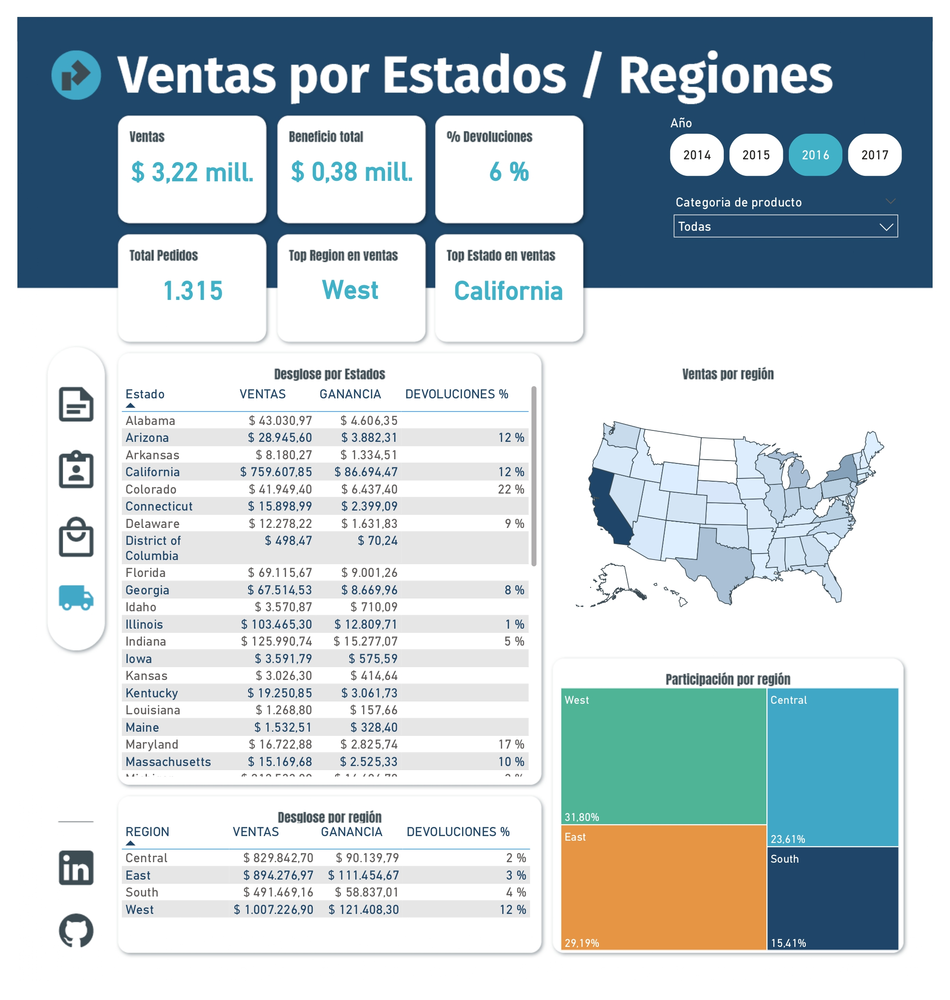

# 📊 Dashboard de Análisis de Ventas - Power BI

Un dashboard interactivo desarrollado en Power BI para analizar patrones de ventas, rentabilidad y tendencias de productos. El proyecto incluye un pipeline completo de procesamiento de datos desde Python hasta la visualización final.


### Pipeline de Datos
1. **🐍 Python**: Análisis exploratorio, transformación y limpieza de datos
2. **🗄️ SQL Server**: Almacenamiento estructurado usando SQLAlchemy desde Python
3. **📊 Power BI**: Visualización interactiva y análisis avanzado

## 🎯 Características Principales

- **Pipeline Completo**: Desde datos crudos hasta visualización final
- **Análisis de Ventas**: Seguimiento de ingresos por categoría, región y período
- **Rentabilidad**: Análisis de margen de ganancia y productos más rentables  
- **Tendencias Temporales**: Visualización de patrones de venta a lo largo del tiempo
- **Top Performers**: Identificación de productos y categorías con mejor desempeño
- **Análisis de Devoluciones**: Métricas de productos con mayor tasa de devolución 


## 📁 Estructura del Proyecto

```
dashboard-ventas/
├── README.md
├── reporte.pbix                  # Archivo principal de Power BI
├── assets/
│   ├── screenshots/              # Capturas del dashboard
│   └── database/              # Datos de muestra (opcional)
├── docs/
│   ├── design/         # Diseños y Mockups
│   └── scripts/      # Código en python
```


## 📊 Fuente de Datos

- **Tablas de hechos**:  
  - `factVentas` - detalles de las ventas
  - `factDetalles` - detalles de las ventas
- **Dimensiones**: 
  - `dimProducto` - Información de productos y categorías
  - `dimCalendario` - Dimensión temporal
  - `dimCliente` - Datos de clientes
  - `dimModoEntrega` - Como se hizo la entrega del producto
  - `dimVendedor` - Datos de los vendedores
  - `dimRegion` - Datos territoriales


## 🎨 Capturas de Pantalla

### Portada
  

### Resumen
  

### Clientes y Vendedores
  

### Productos
  

### Estado y Regiones
  


# 🐍Python

### Librerías de Python
```txt
pandas  
numpy  
matplotlib  
seaborn  
sqlalchemy
```
### Notebook

[Notebook de python](https://www.ejemplo.com)


## 📧 Contacto

**Tu Nombre**
- GitHub: [@gpelo-data](https://github.com/gpelo-data)
- LinkedIn: [Gastón Peló](https://linkedin.com/in/gpelo-data)
- Email: gaston.pelo.contacto@gmail.com
